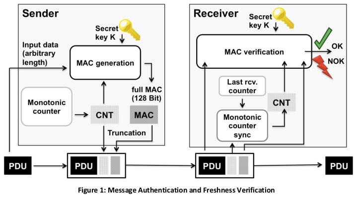

# SecOC_Module
## 1. Description
### 1.1 Definition

SecOC (Secure on-board communication) is an integral module at the Autosar communication stack, serving to ensure the authenticity and freshness of PDU based communication between ECUs whitin the vehicule architecture, it encompasses essential features such as encryption/decryption, key and fresh value management. 

### 1.2 Functional overview

The purpose of the secure on-board Communication (SecOC) module is to provide an AUTOSAR BSW Module to transmit secured data between two or more peers exchanging information over an automotive embedded network.

